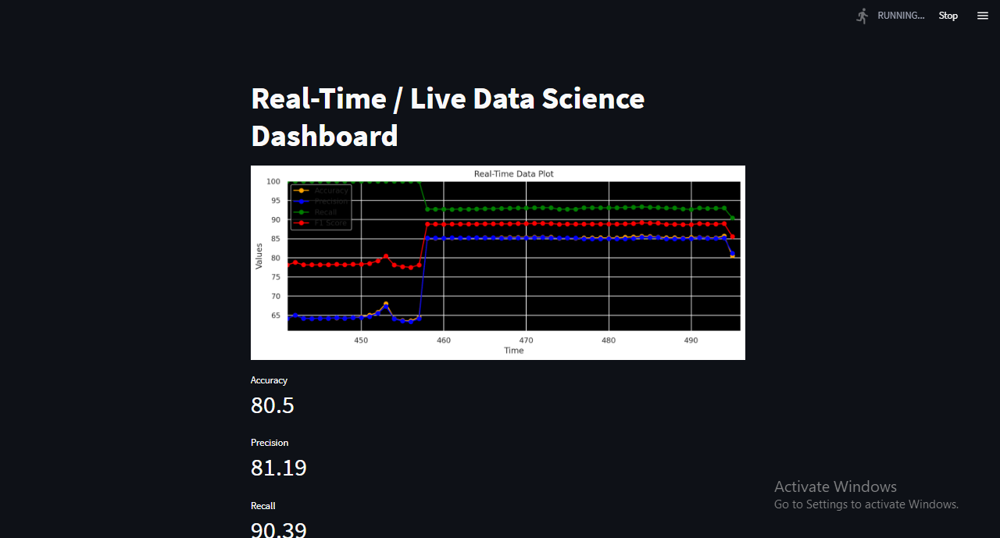

# 🚀 Sliding Window Adaptive Beta Distribution Drift Detection (SABDDeM) Flink Application

## 🧠 Overview

This project implements a **real-time streaming data pipeline** powered by **Apache Flink** to detect **concept drift** using a custom **Sliding Window Adaptive Beta Distribution Drift Detection Model (SABDDeM)**.

It integrates:
- **Kafka** for data streaming  
- **PyFlink** for stream processing  
- **LightGBM** for classification  
- **Custom drift detection (BDDDC)** based on beta distribution  
- **Elasticsearch + Kibana** for monitoring  
- **Redis** for model persistence  
- **Flask + River ML** for API access and secondary detection  

All components are containerized using **Docker Compose** for easy deployment.

## ✨ Key Features

✅ **Real-Time Drift Detection** using SABDDeM with sliding windows and beta distribution thresholds  
✅ **Incremental Learning** with LightGBM, retrained on drift detection  
✅ **Streaming Ingestion** from Kafka (topic: `train_in_1`)  
✅ **Performance Metrics** (Accuracy, Precision, Recall, F1, Latency, Throughput) stored in Elasticsearch  
✅ **Visual Dashboard** with Kibana  
✅ **Flask API** with River ML for predictions and alternate drift monitoring  
✅ **Dockerized Stack** – Kafka, Zookeeper, Flink, Elasticsearch, Kibana, Redis, and Flask

## 📁 Project Structure

```
flinkapp/
├── docker-compose.yml                 # Manages containers
├── consumer_flink/                   # PyFlink logic & drift detection
│   ├── consumer_flink.py             # Main consumer with LightGBM & SABDDeM
│   ├── beta_distribution_drift_detector/
│   │   ├── bdddc.py, bddd.py         # Core SABDDeM classes
│   └── requirements.txt
├── producer/                         # Kafka producer (CSV → Kafka)
│   ├── producer.py
│   └── Dockerfile
├── pyflink_riverml/                  # Flask API with River ML
│   ├── drift_detectorml.py
│   └── data/sea_a2.csv
├── kibana/                           # Kibana dashboard config
│   ├── export.ndjson
│   └── load_ndjson.sh
```

## ⚙️ Prerequisites

- Docker & Docker Compose  
- Python 3.8+  
- Apache Flink 1.14+ (via PyFlink)  
- Kafka 2.13-2.7.0  
- Elasticsearch 7.8.0 & Kibana  
- Redis 6.0.9 (`password: redis_password`)  
- MySQL 8.0.22 *(optional, not required)*

## 🚀 Setup Instructions

### 1. Clone the Repo

```bash
git clone https://github.com/AkinwandeSlim/FlinkApp.git
cd FlinkApp
```

### 2. Install Dependencies

```bash
pip install -r consumer_flink/requirements.txt
pip install -r pyflink_riverml/requirements.txt
```

### 3. Add Data

Place `sea_a2.csv` in `pyflink_riverml/data/`  
Or update the `DATA` path in `docker-compose.yml`.

## 📦 Run the Application

### 1. Start All Services

```bash
docker-compose up -d
```

### 2. Run the Kafka Producer

```bash
docker build -t producer ./producer
docker run producer
```

### 3. Run the Flink Consumer

```bash
docker build -t consumer-flink ./consumer_flink
docker run consumer-flink
```

### 4. Launch the Flask API (River ML)

```bash
docker build -t drift-detector ./pyflink_riverml
docker run -p 5000:5000 drift-detector
```

## 📊 Visualization & API Usage

- **Kibana Dashboard**: [http://localhost:5601](http://localhost:5601)  
  → Index: `Drift_data`

- **Flink Dashboard**: [http://localhost:8081](http://localhost:8081)

- **Flask API**: [http://localhost:5000/predict](http://localhost:5000/predict)

Example API Request (JSON):

```json
{
  "x": { "attrib1": 1.0, "attrib2": 2.0, "attrib3": 3.0 },
  "y": 1
}
```

## 🔍 How It Works

### 🛰️ Data Streaming

- `producer.py` reads `sea_a2.csv`, adds timestamps, and streams to `train_in_1` topic every 0.9s.

### 🧠 Drift Detection

- `consumer_flink.py` trains LightGBM with `win1=10` data points.
- SABDDeM flags drift using error rate + beta thresholds:
  - Warning: `a = 0.99`
  - Drift: `b = 0.95`
- On drift, model retrains on `win2=20` recent records.
- Metrics are computed and pushed to Elasticsearch.

### 🧪 Flask API with River ML

- Logistic regression model retrains on detected drift.
- Secondary detection using the same BDDDC logic.

## ⚙️ Configuration Highlights

| Component        | Configurations                                     |
|------------------|----------------------------------------------------|
| **Kafka**        | Topic: `train_in_1`, Broker: `kafka:9092`          |
| **Elasticsearch**| Host: `http://elasticsearch:9200`, Index: `Drift_data` |
| **Redis**        | Host: `localhost:6379`, Password: `redis_password` |
| **SABDDeM**      | Warning: `a=0.99`, Drift: `b=0.95`, Windows: 10/20  |
| **API**          | Port: `5000`                                       |

## 📝 Notes

- Ensure enough memory for **Elasticsearch** and **Flink** containers.
- Flask API uses **River ML (logistic regression)** vs. **LightGBM** in Flink – this may cause prediction variations.
- MySQL service in Docker is not used in current logic (safe to remove).
- For better metrics, improve `calculate_latency()` and `calculate_throughput()` in `consumer_flink.py`.

## 🔮 Future Improvements

- Unify `dump_model` functions in consumer.
- Align Flask model with Flink LightGBM for consistent detection.
- Add per-class drift detection to Kibana.
- Optimize SABDDeM hyperparameters (`a`, `b`, `win1`, `win2`).
- Integrate **Streamlit** dashboard (optional future addition).

## 🪪 License

This project is licensed under the **MIT License**.


## 📸 Sample Output Screenshot

Below is an example of the output from the system as visualized in Kibana or served through the Flask API:


